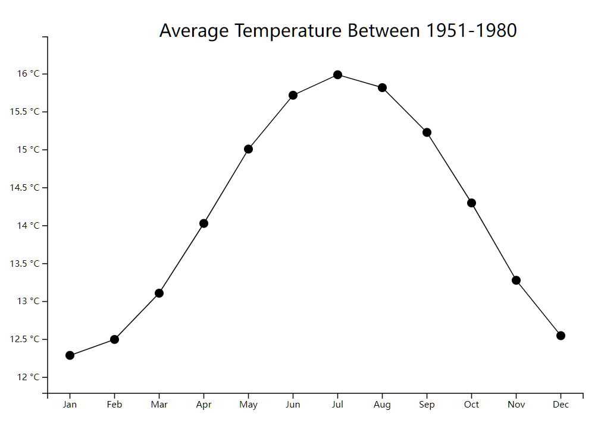
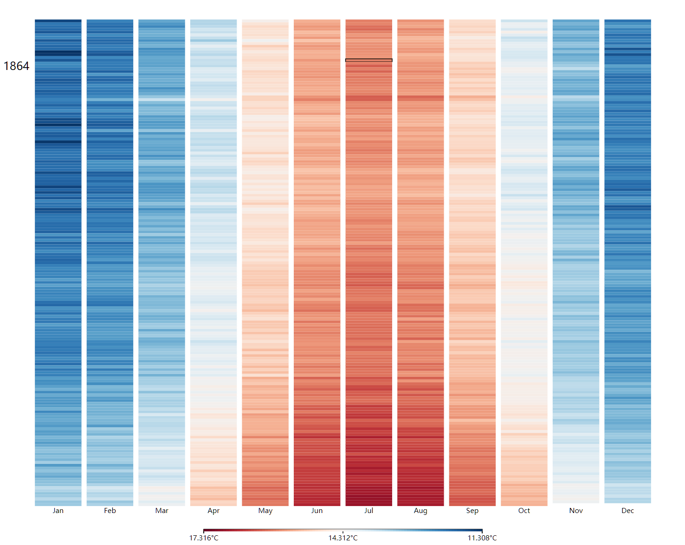

# Homework 1

Author: Ye HengWei 2020533027 yehw@shanghaitech.edu.cn

The source file is already packaged in the `zip`. You can view the final effects follow the links **directly on the web** , but I **encrypted** the `js` in the `html`, so others can't see my code. 

## 1-1

html link: https://data-visualization-production.up.railway.app/hw1/html/hw1-1.html

I created a **line chart** to present average temperature between 1951-1980 more intuitively. On the vertical axis, I took the maximum and minimum temperature plus or minus 0.5 degrees to make the curve look fuller.

## 1-2

html link: https://data-visualization-production.up.railway.app/hw1/html/hw1-2.html

I created a **heatmap** to present the absolute temperature values from 1850-2022. By calculating the minimum and maximum temperatures in these time periods, map them to zero to one to show the corresponding colors. Because there are so many years, the year information will only be displayed on the left side when the mouse moves over the corresponding box. Also, there's a bottom legend shows the relationship between temperature and color.

